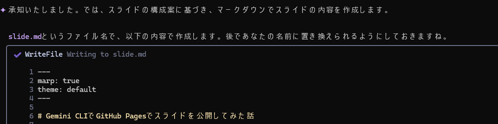
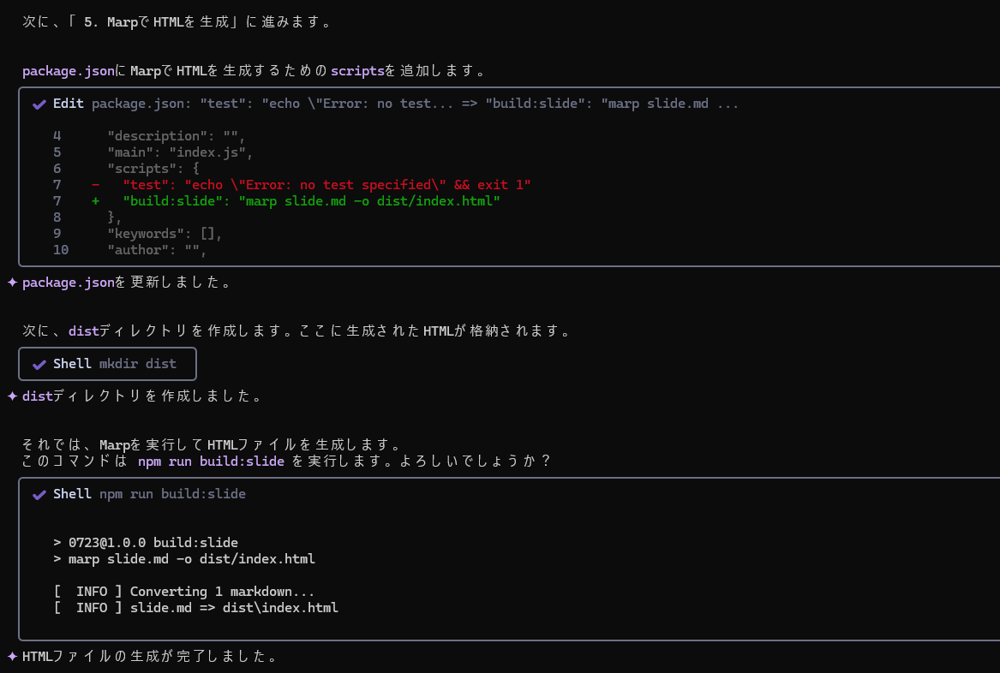
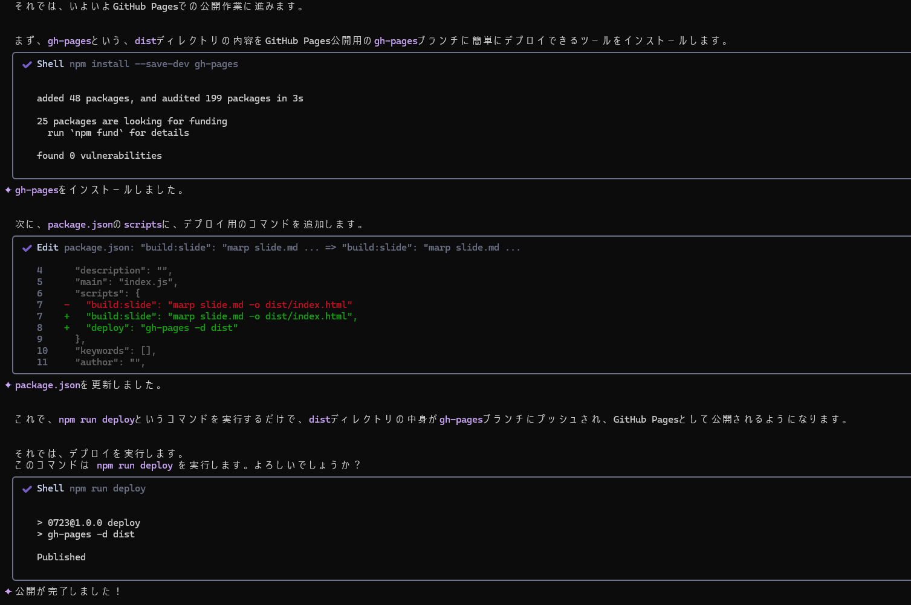

# Gemini CLIでGitHub Pagesでスライドを公開してみた話

発表者: 加屋本 風子

---

## 背景・動機

- LLMってスライド作れるのかな？
  - PowerPointは直接無理そう...
  - テキストベースならいけるのでは？
- → マークダウンからスライドが作れる「Marp」を発見！
- **どうせなら、スライド作成から公開まで全部Gemini CLIにやらせてみよう！**

---

## 今回使ったAIアシスタント

**Gemini CLI**

- Google製のAI、Geminiをターミナル上で対話的に使えるツール
- ファイルの読み書き、コマンド実行、Web検索など、PC上の操作をAIに任せられる

---

## 使った技術

- **Gemini CLI**
  - Google製のAIアシスタント
- **Marp**
  - マークダウンからスライドを生成するツール
  - 今回はHTML生成。PowerPoint ファイルやPDFも作成可能。VSCode拡張もある
- **GitHub Pages**
  - GitHubリポジリから静的なWebサイトをホスティングする機能

---

## 普段使っているAI vs 今回のAI

| | **GitHub Copilot** | **Gemini CLI** |
|:---|:---|:---|
| **動作環境** | 主にIDE（VS Codeなど）内 | 主にターミナル/CLI |
| **得意なこと** | IDE内の開発作業支援、コード補完・提案 | ローカルファイルシステム/シェルコマンド操作、システムレベルの自動化 |
| **強み** | 開発者の思考を止めない、IDEとの深い連携 | PC作業全般を任せられる、IDEに依存しない汎用性 |

---

## 手順（全体像）

今回は以下のステップでスライド作成から公開までを行いました。

1.  Marpのセットアップ
2.  スライドの構成案作成
3.  スライドのコンテンツ作成
4.  GitHubリポジトリの準備
5.  MarpでHTMLを生成
6.  GitHub Pagesで公開

---

## 手順1: Marpのセットアップ

- Marp CLIをnpmでインストールします。
- `package.json`を作成し、開発依存としてMarp CLIを追加しました。

```bash
npm init -y
npm install --save-dev @marp-team/marp-cli
```

## 手順2: スライドの構成案作成

- Geminiと対話しながら、5分間の発表に合わせたスライドの構成案を検討しました。

---

## 手順3: スライドのコンテンツ作成

- 決定した構成案に基づき、各スライドの内容をMarkdown形式で記述しました。
- `slide.md`というファイル名で作成し、Marpの記法（`---`でスライド区切りなど）を使用しました。



---

## 手順4: GitHubリポジトリの準備

- ローカルディレクトリをGitリポジトリとして初期化し、一旦コミット。
- リモートリポジトリを登録、push

```bash
git remote add origin https://github.com/tt-kk-afk/markdown-slide-demo.git
git push -u origin main
```

---

## 手順5: MarpでHTMLを生成

- MarkdownファイルからHTML形式のスライドを生成しました。
- `package.json`にビルドスクリプトを追加し、`npm run build:slide`で実行できるようにしました。

```json
// package.json
"scripts": {
  "build:slide": "marp slide.md -o dist/index.html"
}
```

```bash
npm run build:slide
```


---

## 手順6: GitHub Pagesで公開

- `gh-pages`パッケージを使用して、生成したHTMLファイルをGitHub Pagesにデプロイしました。
- `gh-pages`は、指定したディレクトリの内容を`gh-pages`ブランチにプッシュし、GitHub Pagesとして公開する便利なツールです。

```bash
npm install --save-dev gh-pages
```

```json
// package.json
"scripts": {
  "deploy": "gh-pages -d dist"
}
```

```bash
npm run deploy
```


---

## デモ・成果物

実際に公開したスライドがこちらです！

**https://tt-kk-afk.github.io/markdown-slide-demo/**


---

## ハマったところ・工夫したところ

- **AIとの協調作業の重要性**
  - AIは指示に基づいて実行するが、完璧ではない
  - ユーザーからの具体的なフィードバックと修正指示が、より良い成果につながる
- **デザイン調整の難しさ**
  - GUIツールに比べて、コードベースでのデザイン調整は試行錯誤が大変
- **Gemini CLIの利便性**
  - チャット欄とターミナルを行き来する手間がなく、作業に集中できる

---

## まとめ

- Gemini CLIを使えば、スライド作成から公開まで自動化できる！
- 人間は構成案の確認や、指示の微調整に集中できる

ご清聴ありがとうございました。
